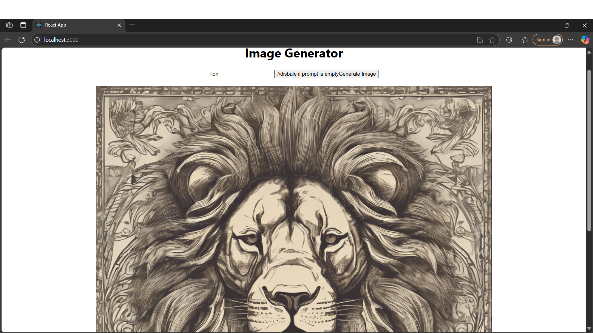

<!--
  README.md with HTML + Markdown
  Replace placeholders (YOUR-USERNAME, YOUR-REPO, etc.) before committing.
-->

<div align="center">

  <!-- Hero / Title -->
  <h1 style="margin-bottom:0.2rem;">🧠 AI Prompt Generator</h1>
  <p style="margin-top:0.2rem;">Django + Django REST Framework backend • React frontend — type a prompt and get AI-generated responses via API key</p>

  <!-- Badges (shields.io) -->
  <p>
    
    
    
    
    
  </p>

  <!-- Screenshot placeholder -->
  
</div>

---

## ✨ Project Overview

This repository contains a **full-stack application** that wires a **React** frontend to a **Django + Django REST Framework** backend.  

- Users type a **prompt** in the frontend.  
- The backend securely forwards the request to an **AI API** (with a secret key).  
- The AI’s response is returned to the user in real time.  

**Why this project is special?**  
It cleanly separates frontend & backend, handles API keys securely, and is designed for fast deployment with **Docker**.

---

## 🚀 Features

- **Prompt → Response**: Type anything and instantly get an AI-generated reply.  
- **Secure Key Handling**: API keys stay on the backend — never exposed to the browser.  
- **Modern Frontend**: React 18 with Hooks for a clean and responsive UI.  
- **Extensible Backend**: Django + DRF endpoints make it easy to plug in other AI or data services.  
- **Configurable DB**: Ships with SQLite by default, can scale to PostgreSQL/MySQL.  
- **Dockerfile Support**: Comes with a `Dockerfile` to build images & containers, making it easier for anyone to run the project without setup issues.  

---

## ⚙️ Installation & Setup

```bash
# Clone the repository
git clone https://github.com/YOUR-USERNAME/YOUR-REPO.git
cd YOUR-REPO

# Backend setup
cd image
pip install -r requirements.txt
python manage.py migrate
python manage.py runserver

# Frontend setup
cd image/frontend
npm install
npm start
